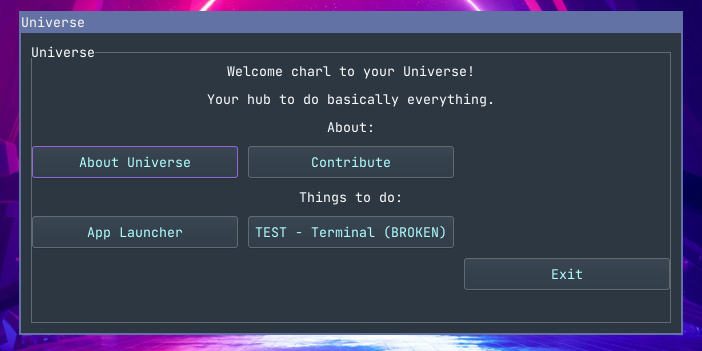

 

# What is Universe?
Universe is an app to do pretty much everything, from running little bash/python scripts, to running terminal commands, all the way to browsing the web.

# Why create Universe?
Well, I've wanted something to do everything for a while now, and nothing I've found has met the specific needs that I have, which is why I started this project. Everyone is allowed to contribute, and contributions are encouraged.

Screenshots

📁 Roadmap

 

   | Task | Status | Expected Release |
   | :--- | :--- | :--- |
   | Add window | In Progress | v0.1 |
   | Add scrip tab | Not Started | v0.1 |
   | Add run script buttons | Not Started | v0.1 |
   | Add terminal tab  | Not Started | v0.5 |

 

# Other Information
## How to contribute
To find how to contribute, please visit [CONTRIBUTE.md](CONTRIBUTE.md)